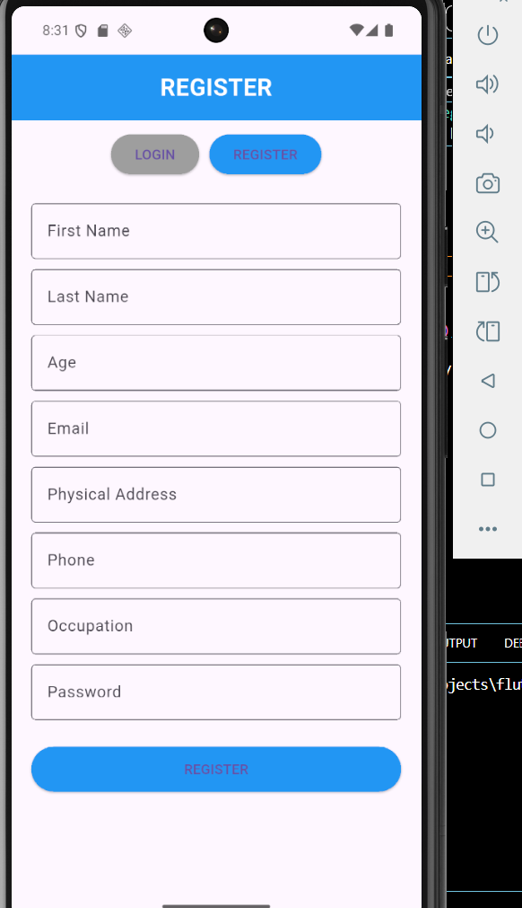
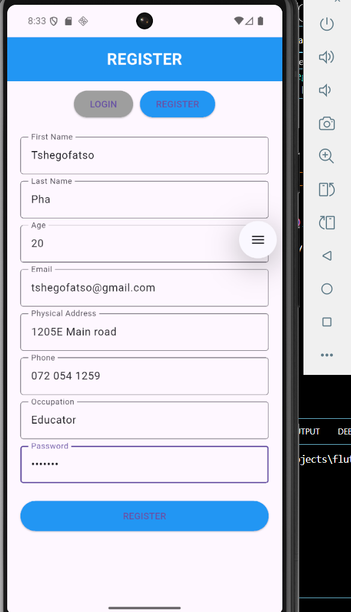
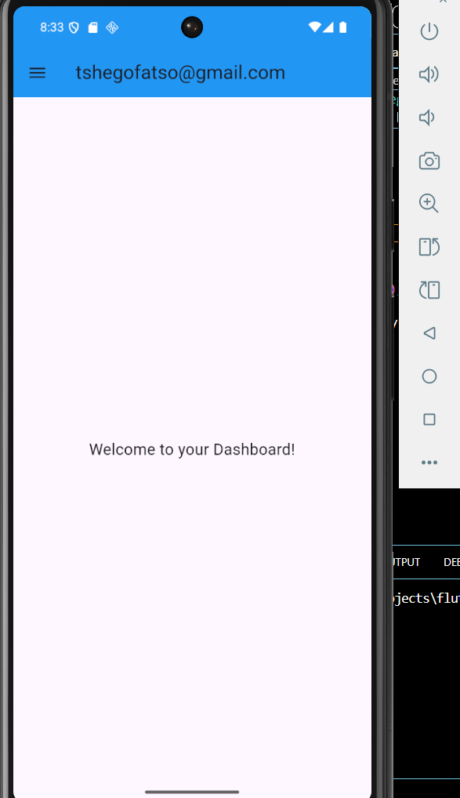
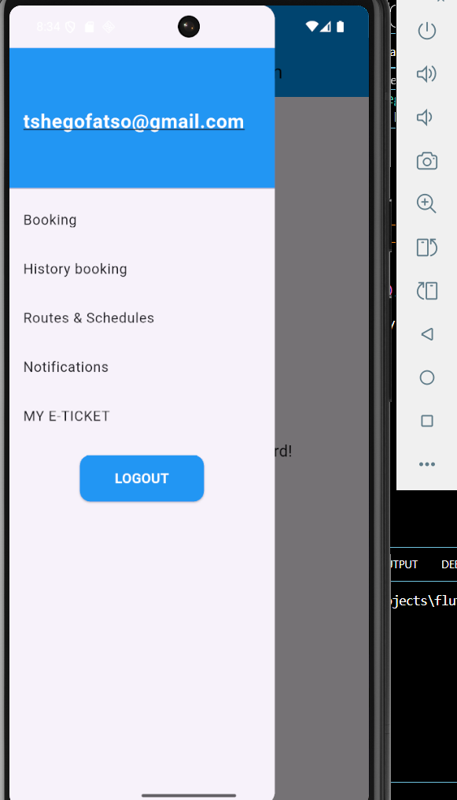
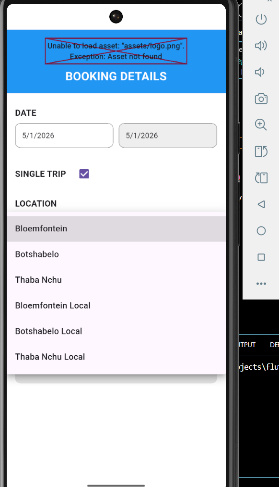
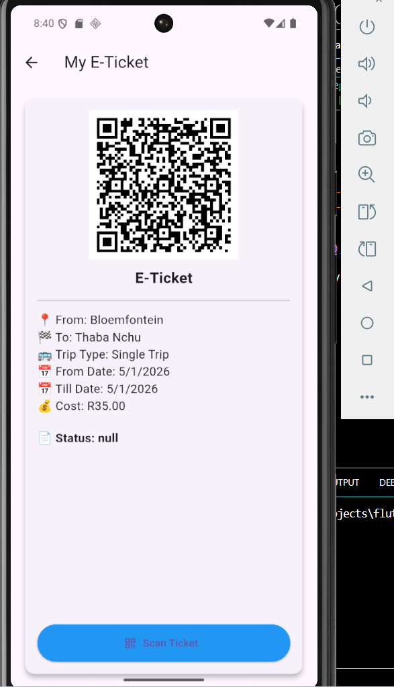
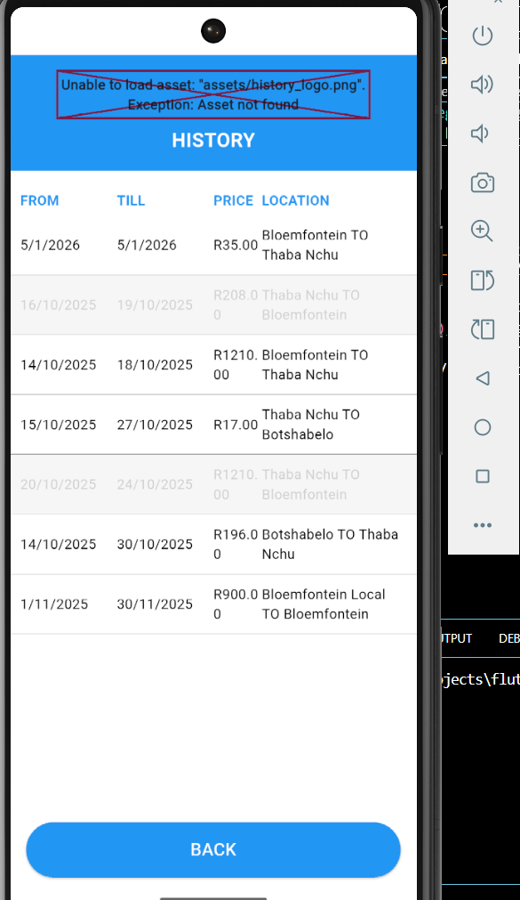
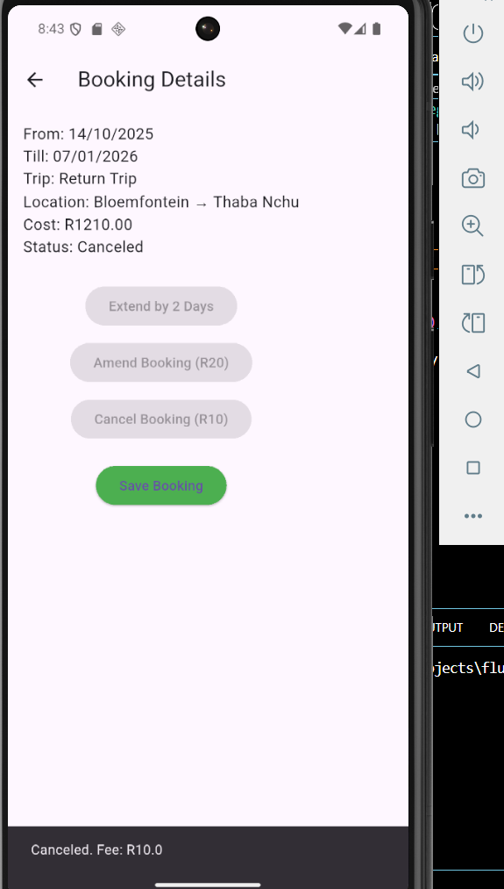

# Online Bus Ticketing System

A mobile-based online bus ticketing application developed using Flutter and Dart. 
The system is designed to modernize traditional bus ticketing by allowing users to register, log in, and receive electronic tickets in the form of QR/barcodes.

## Features
- User registration and login
- Forgot and reset password functionality
- QR / barcode-based electronic ticket generation
- User data validation (email, age, mobile number)
- Clean and user-friendly interface

## Technologies Used
- Flutter
- Dart
- Firebase / Backend (planned)
- QR / Barcode generation

## Project Type
Academic Project (Software Development)

## Screenshots
## 📸 Screenshots

## 📸 Screenshots

### Authentication

### Dashboard & Navigation

### Booking Process

### Booking Management

## Future Improvements
- Backend integration for ticket storage
- Admin dashboard for bus operators
- Online payment integration
- Ticket validation scanning feature

## Author
**Tshegofatso Phakwe**  
Advanced Diploma in Software Development

